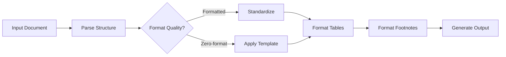

[English](README.md) | [中文](README_CN.md)

<div align="center">

# 📄 doc-form-master

**Professional DOCX Document Formatting Agent**

*Transform your academic papers, official documents, and technical reports into perfectly formatted documents with one click.*

[](https://www.python.org/downloads/)
[](LICENSE)
[](https://www.microsoft.com/windows)

[Quick Start](#quick-start) · [Features](#features) · [Templates](#templates) · [Documentation](#documentation)

</div>

---

## Why doc-form-master?

Formatting academic papers is tedious and time-consuming. **doc-form-master** automates the entire process:

| Before | After |
|--------|-------|
| ❌ Manual font and spacing adjustment | ✅ One-click standardization |
| ❌ Broken formulas after formatting | ✅ 100% formula preservation |
| ❌ Inconsistent heading styles | ✅ Smart heading detection |
| ❌ Hours spent on table formatting | ✅ Automatic three-line tables |
| ❌ Lost footnotes and references | ✅ Complete footnote protection |

---

## Features

### 🎯 Core Capabilities

- **Smart Format Detection** - Automatically identifies document structure and applies appropriate formatting
- **Non-Destructive Processing** - Your original files are never modified
- **Formula Protection** - Preserves OMML, MathType, and LaTeX formulas perfectly
- **One-Click Formatting** - Transform messy documents into professional papers instantly

### 📝 Format Support

| Format | Standard | Description |
|--------|----------|-------------|
| Chinese Academic | GB/T 7713.1-2006 | University papers, theses |
| English Academic | APA 7th Edition | Journal articles, reports |
| Official Documents | GB/T 9704-2012 | Government documents |
| Custom Templates | YAML/JSON | Your own formatting rules |

### 🔧 Processing Features

- **DOC/DOCX/Markdown** - Auto-convert between formats
- **Smart Headings** - Detect Chinese/English heading patterns
- **Three-Line Tables** - Academic standard table formatting
- **Footnotes & Endnotes** - Proper numbering and formatting
- **Table of Contents** - Auto-generated with page numbers
- **Headers & Footers** - Custom text and page numbering
- **PDF Export** - High-quality output

### 🌐 WEB Interface

- **Design Preview** - See changes before applying
- **Format Manager** - Edit templates in browser
- **Real-Time Editing** - Instant preview of formatting changes

---

## Quick Start

### 1. Install

```bash
# Clone the repository
git clone https://github.com/yourusername/doc-form-master.git
cd doc-form-master

# Install dependencies
pip install -r requirements.txt
```

### 2. Run

```bash
# Open your AI IDE or Agent software (e.g., Trae, Cursor, Windsurf)
# Load AGENT.md as the agent configuration
# Then describe your requirements:
"Format my paper according to Chinese academic standards"
"Convert this document to APA format"
"Format the tables and protect all formulas"
```

### 3. Done!

Your formatted document will be in `workspace/output/`

---

## Demo

```
┌─────────────────────────────────────────────────────────────┐
│  📂 Input: messy_paper.docx                                 │
├─────────────────────────────────────────────────────────────┤
│  ↓ doc-form-master processes...                             │
│    ✓ Detect structure                                       │
│    ✓ Apply formatting                                       │
│    ✓ Protect formulas                                       │
│    ✓ Format tables                                          │
│    ✓ Generate TOC                                           │
├─────────────────────────────────────────────────────────────┤
│  📄 Output: formatted_paper.docx                            │
└─────────────────────────────────────────────────────────────┘
```

---

## Templates

Built-in templates follow international standards:

| Template | Use Case | Key Features |
|----------|----------|--------------|
| `chinese_academic.yaml` | Chinese university papers | GB/T 7713.1-2006, Song/Heiti fonts |
| `english_academic.yaml` | English journal articles | APA 7th, Times New Roman |

### Custom Templates

Create your own formatting rules:

```yaml
# my_template.yaml
fonts:
  chinese:
    family: 宋体
    size: 12
  english:
    family: Times New Roman
    size: 12

heading:
  level1:
    font: 黑体
    size: 16
    bold: true
    alignment: center
```

---

## Project Structure

```
doc-form-master/
├── AGENT.md                    # Agent configuration
├── SKILLS/                     # Modular processing skills
│   ├── docx-parser/            # Document structure analysis
│   ├── format-normalizer/      # Format standardization
│   ├── formula-protection/     # Math formula preservation
│   ├── table-processor/        # Table formatting
│   ├── footnote-processor/     # Footnote handling
│   └── ...                     # 15+ specialized skills
├── workspace/                  # Your documents
│   ├── input/                  # Place files here
│   └── output/                 # Get results here
└── requirements.txt            # Dependencies
```

---

## How It Works



---

## Documentation

- [Agent Configuration](AGENT.md) - Detailed processing rules
- [Template Guide](SKILLS/format-normalizer/custom/) - Create custom templates
- [API Reference](SKILLS/) - Skill module documentation

---

## Contributing

Contributions are welcome! Please feel free to submit a Pull Request.

1. Fork the repository
2. Create your feature branch (`git checkout -b feature/amazing-feature`)
3. Commit your changes (`git commit -m 'Add amazing feature'`)
4. Push to the branch (`git push origin feature/amazing-feature`)
5. Open a Pull Request

---

## License

This project is licensed under the GPL-3.0 License - see the [LICENSE](LICENSE) file for details.

---

<div align="center">

**Made with ❤️ for researchers and writers**

[⬆ Back to top](#-doc-form-master)

</div>
