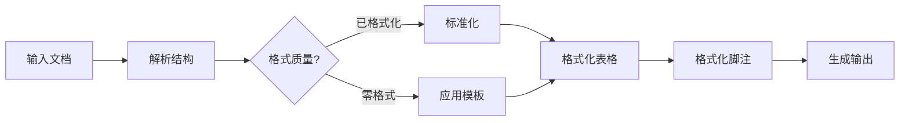

[English](README.md) | [中文](README_CN.md)

<div align="center">

# 📄 doc-form-master

**专业 DOCX 文档格式化智能体**

*一键将您的学术论文、公文和技术报告转换为完美格式的文档。*

[](https://www.python.org/downloads/)
[](LICENSE)
[](https://www.microsoft.com/windows)

[快速开始](#快速开始) · [功能特性](#功能特性) · [模板说明](#模板说明) · [文档](#文档)

</div>

---

## 为什么选择 doc-form-master？

格式化学术论文既繁琐又耗时。**doc-form-master** 可以自动完成整个过程：

| 使用前 | 使用后 |
|--------|--------|
| ❌ 手动调整字体和间距 | ✅ 一键标准化 |
| ❌ 格式化后公式损坏 | ✅ 100% 公式保护 |
| ❌ 标题样式不一致 | ✅ 智能标题检测 |
| ❌ 花费数小时格式化表格 | ✅ 自动生成三线表 |
| ❌ 脚注和参考文献丢失 | ✅ 完整脚注保护 |

---

## 功能特性

### 🎯 核心能力

- **智能格式检测** - 自动识别文档结构并应用合适的格式
- **非破坏性处理** - 永远不会修改原始文件
- **公式保护** - 完美保留 OMML、MathType 和 LaTeX 公式
- **一键格式化** - 瞬间将杂乱文档转换为专业论文

### 📝 格式支持

| 格式 | 标准 | 说明 |
|------|------|------|
| 中文学术论文 | GB/T 7713.1-2006 | 大学论文、学位论文 |
| 英文学术论文 | APA 第 7 版 | 期刊文章、报告 |
| 党政机关公文 | GB/T 9704-2012 | 政府公文 |
| 自定义模板 | YAML/JSON | 您自己的格式规则 |

### 🔧 处理功能

- **DOC/DOCX/Markdown** - 自动格式转换
- **智能标题识别** - 检测中英文标题模式
- **三线表格式化** - 学术标准表格格式
- **脚注和尾注** - 正确的编号和格式
- **自动生成目录** - 包含页码的目录
- **页眉页脚** - 自定义文本和页码格式
- **PDF 导出** - 高质量输出

### 🌐 WEB 界面

- **设计预览** - 应用前查看效果
- **格式管理器** - 在浏览器中编辑模板
- **实时编辑** - 即时预览格式变化

---

## 快速开始

### 1. 安装

```bash
# 克隆仓库
git clone https://github.com/yourusername/doc-form-master.git
cd doc-form-master

# 安装依赖
pip install -r requirements.txt
```

### 2. 运行

```bash
# 打开 AI IDE 或 Agent 软件（如 Trae、Cursor、Windsurf）
# 加载 AGENT.md 作为智能体配置
# 然后输入您的需求：
"按照中文学术论文格式化我的论文"
"将此文档转换为 APA 格式"
"格式化表格并保护所有公式"
```

### 3. 完成！

格式化后的文档将在 `workspace/output/` 中

---

## 演示

```
┌─────────────────────────────────────────────────────────────┐
│  📂 输入：杂乱论文.docx                                      │
├─────────────────────────────────────────────────────────────┤
│  ↓ doc-form-master 处理中...                                 │
│    ✓ 检测结构                                               │
│    ✓ 应用格式                                               │
│    ✓ 保护公式                                               │
│    ✓ 格式化表格                                             │
│    ✓ 生成目录                                               │
├─────────────────────────────────────────────────────────────┤
│  📄 输出：格式化论文.docx                                     │
└─────────────────────────────────────────────────────────────┘
```

---

## 模板说明

内置模板遵循国际标准：

| 模板 | 用途 | 主要特点 |
|------|------|----------|
| `chinese_academic.yaml` | 中文学术论文 | GB/T 7713.1-2006，宋体/黑体字体 |
| `english_academic.yaml` | 英文期刊文章 | APA 第 7 版，Times New Roman |

### 自定义模板

创建您自己的格式规则：

```yaml
# my_template.yaml
fonts:
  chinese:
    family: 宋体
    size: 12
  english:
    family: Times New Roman
    size: 12

heading:
  level1:
    font: 黑体
    size: 16
    bold: true
    alignment: center
```

---

## 项目结构

```
doc-form-master/
├── AGENT.md                    # 智能体配置
├── SKILLS/                     # 模块化处理技能
│   ├── docx-parser/            # 文档结构分析
│   ├── format-normalizer/      # 格式标准化
│   ├── formula-protection/     # 数学公式保护
│   ├── table-processor/        # 表格格式化
│   ├── footnote-processor/     # 脚注处理
│   └── ...                     # 15+ 专业技能
├── workspace/                  # 您的文档
│   ├── input/                  # 放入文件
│   └── output/                 # 获取结果
└── requirements.txt            # 依赖项
```

---

## 工作原理



---

## 文档

- [智能体配置](AGENT.md) - 详细的处理规则
- [模板指南](SKILLS/format-normalizer/custom/) - 创建自定义模板
- [API 参考](SKILLS/) - 技能模块文档

---

## 贡献

欢迎贡献！请随时提交 Pull Request。

1. Fork 仓库
2. 创建功能分支 (`git checkout -b feature/amazing-feature`)
3. 提交更改 (`git commit -m 'Add amazing feature'`)
4. 推送到分支 (`git push origin feature/amazing-feature`)
5. 提交 Pull Request

---

## 许可证

本项目采用 GPL-3.0 许可证 - 详见 [LICENSE](LICENSE) 文件。

---

<div align="center">

**为研究人员和写作者用心打造 ❤️**

[⬆ 回到顶部](#-doc-form-master)

</div>
